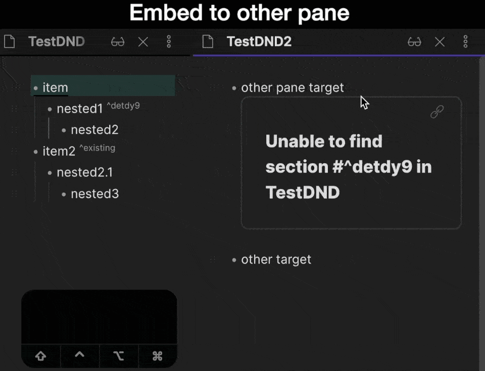

# Demo

# Features

-   [x] Drag-n-drop for list items in the same pane and between different panes
-   [x] 3 modes: move block, copy block, embed block
-   [x] Automatic reference link generation for dragged block
-   [x] Live editor support
-   [x] Multi-line list items support
-   [x] Visual guidance during dragging

# Roadmap

-   [ ] Support for arbitrary block dragging - paragraphs, headings etc

# How to use

You can see a drag-n-drop handler in the gutter. You can drag it and drop at line you want.

For now you can drag only list items, so handler will appear only near lines that belongs to list

## Defaults

-   Drag and drop from one pane to another without modifiers will create embed link for the block. Id for block will be automatically created.
-   Drag and drop in the same pane without modifiers will move the block.
-   Drag and drop with "Shift" modifier will copy the block.

You can change behavior for settings in the plugin settings tab.

# How to install

## From within Obsidian

_NOT YET AVAILABLE_

You can activate this plugin within Obsidian by doing the following:

-   Open Settings > Third-party plugin
-   Make sure Safe mode is off
-   Click Browse community plugins
-   Search for "Drag-n-Drop"
-   Click Install
-   Once installed, close the community plugins window and activate the newly installed plugin

## BRAT

-   Install BRAT plugin
-   Add repository _artem-barmin/obsidian-block-drag-n-drop_
-   Enable it

## Manual installation

Download main.js, manifest.json, styles.css from the latest release and put them into <vault>/.obsidian/plugins/obsidian-outliner folder.

# Limitations
	
Plugin was developed and tested only with Live preview editor. Legacy editor not supported
